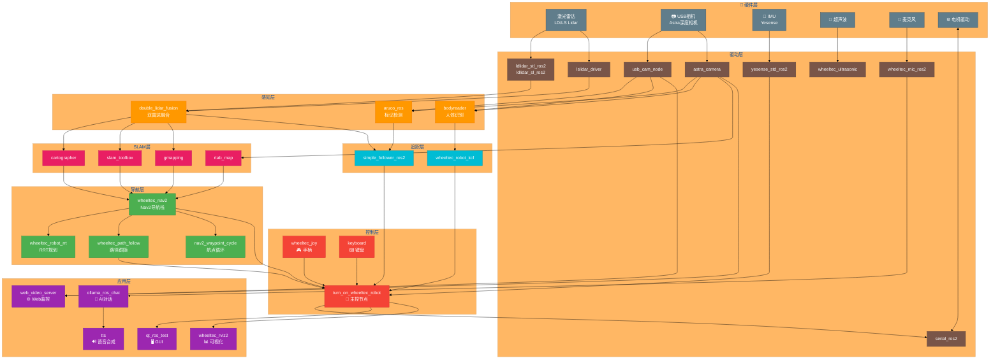
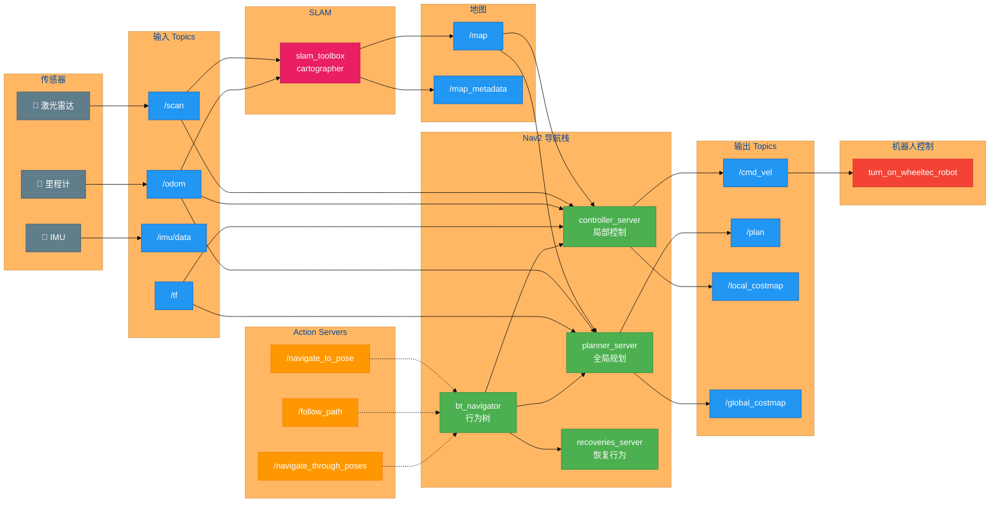
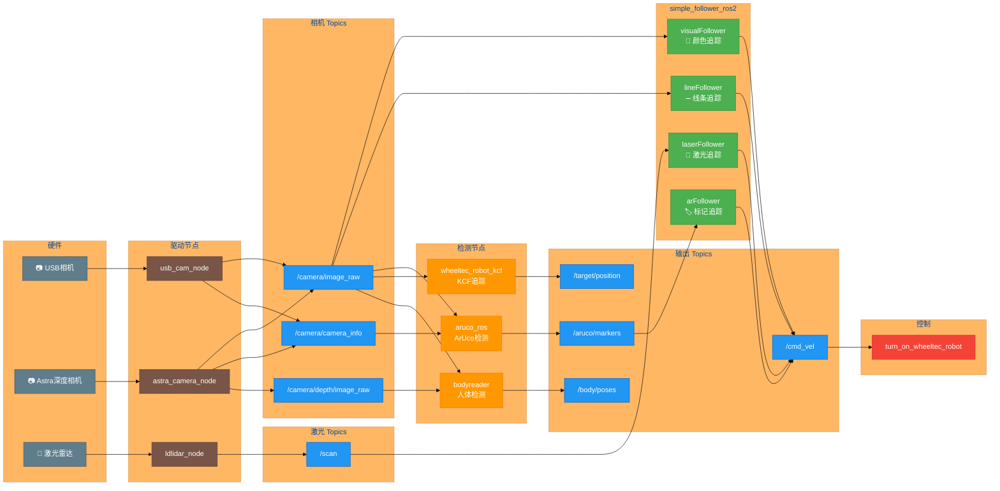
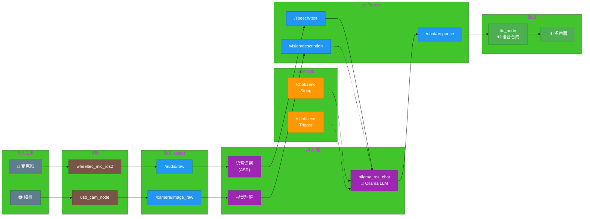

# Wheeltec S300 机器人系统架构

## 1. 整体系统架构图

---

## 2. 导航系统数据流

---

## 3. 视觉追踪系统

---

## 4. AI 交互系统

---

## 5. 包依赖关系图

```mermaid
%%{init: {'theme': 'base'}}%%

flowchart TD
    subgraph CORE["核心依赖"]
        RCLCPP["rclcpp"]
        RCLPY["rclpy"]
        TF2["tf2_ros"]
    end

    subgraph MSGS["消息类型"]
        SENSOR["sensor_msgs"]
        GEO["geometry_msgs"]
        NAV_M["nav_msgs"]
        STD["std_msgs"]
    end

    subgraph CUSTOM_MSG["自定义消息"]
        ARUCO_M["aruco_msgs"]
        BODY_M["bodyreader_msg"]
        LS_M["lslidar_msgs"]
        MIC_M["wheeltec_mic_msg"]
        OLLAMA_M["ollama_ros_msgs"]
        RRT_M["wheeltec_rrt_msg"]
        ROBOT_I["robot_interfaces"]
    end

    subgraph LIBS["第三方库"]
        OPENCV["OpenCV"]
        PCL["PCL"]
        EIGEN["Eigen3"]
        QT["Qt5"]
    end

    subgraph PACKAGES["功能包"]
        MAIN["turn_on_wheeltec_robot"]
        ARUCO["aruco_ros"]
        SLAM["slam_gmapping"]
        NAV2["wheeltec_nav2"]
        FOLLOW["simple_follower"]
    end

    RCLCPP --> MAIN & ARUCO & SLAM & NAV2
    TF2 --> MAIN & SLAM & NAV2

    SENSOR & GEO --> MAIN
    NAV_M --> SLAM & NAV2

    OPENCV --> ARUCO
    PCL --> SLAM

    ARUCO_M --> ARUCO
    BODY_M --> FOLLOW

    classDef core fill:#f44336,stroke:#d32f2f,color:#fff
    classDef msg fill:#2196f3,stroke:#1565c0,color:#fff
    classDef custom fill:#ff9800,stroke:#f57c00,color:#fff
    classDef lib fill:#607d8b,stroke:#455a64,color:#fff
    classDef pkg fill:#4caf50,stroke:#388e3c,color:#fff

    class RCLCPP,RCLPY,TF2 core
    class SENSOR,GEO,NAV_M,STD msg
    class ARUCO_M,BODY_M,LS_M,MIC_M,OLLAMA_M,RRT_M,ROBOT_I custom
    class OPENCV,PCL,EIGEN,QT lib
    class MAIN,ARUCO,SLAM,NAV2,FOLLOW pkg
```

---

## 功能模块分类表

| 模块 | 包数量 | 主要包 | 功能 |
|------|--------|--------|------|
| **底盘控制** | 5 | turn_on_wheeltec_robot, serial_ros2 | 运动控制、串口通信 |
| **激光雷达** | 4 | ldlidar_*, lslidar_*, double_lidar_fusion | 2D/3D激光扫描 |
| **视觉感知** | 4 | usb_cam, astra_camera, aruco_ros | RGB/深度图像 |
| **SLAM建图** | 5 | cartographer, slam_toolbox, gmapping, rtab_map | 地图构建 |
| **自主导航** | 4 | wheeltec_nav2, path_follow, waypoint_cycle | 路径规划导航 |
| **目标追踪** | 4 | simple_follower, kcf, bodyreader | 人/物体追踪 |
| **AI交互** | 2 | ollama_ros_chat, tts | 语音对话 |
| **Web/GUI** | 2 | web_video_server, qt_ros_test | 远程监控 |
